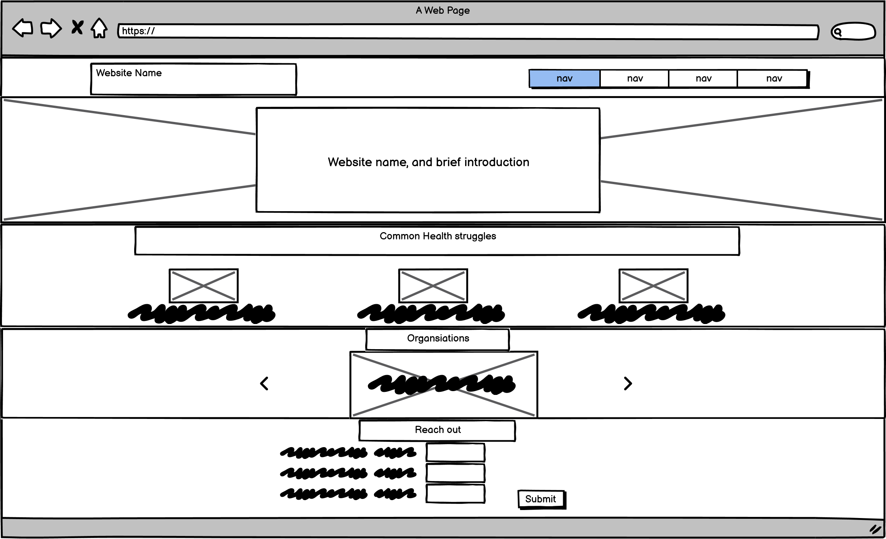
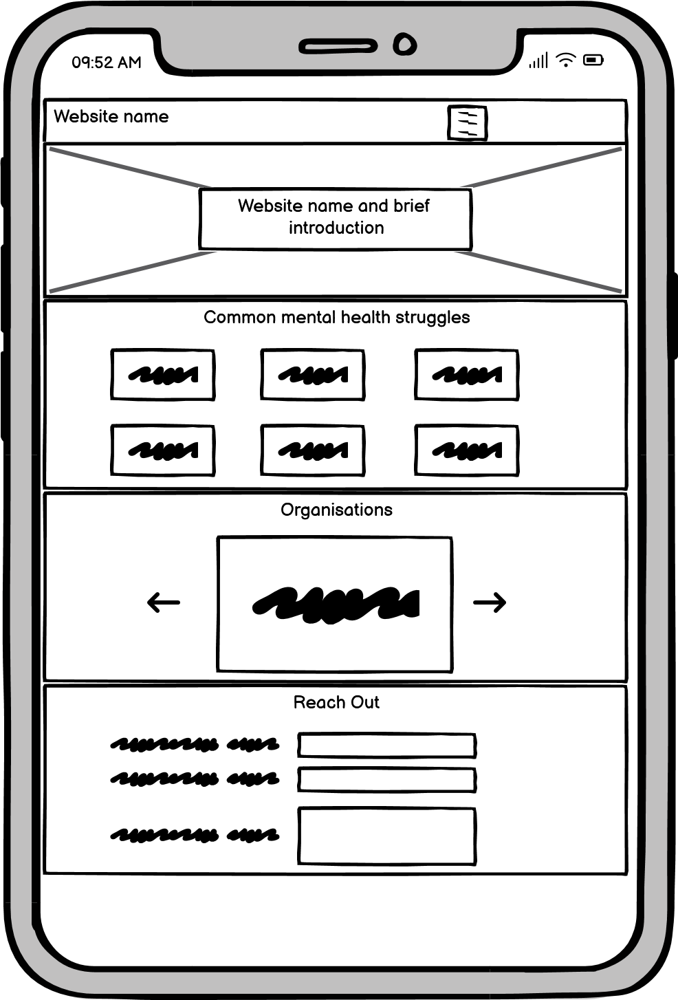
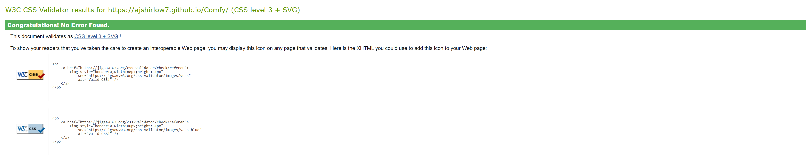
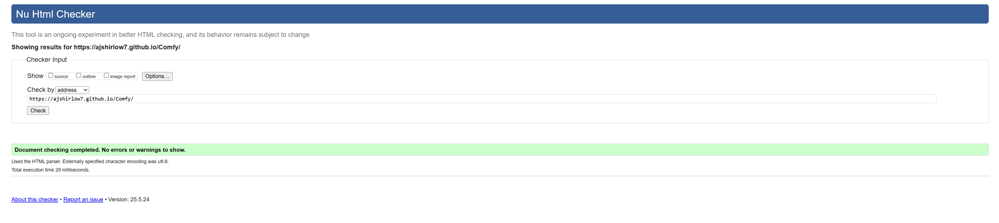
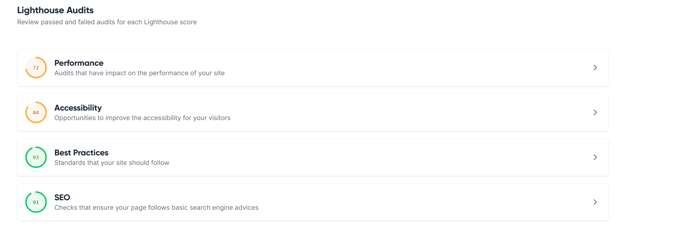

# Comfy

## Introduction

Comfy is a supportive and informative website dedicated to mental health awareness and well-being. Our goal is to provide accessible information about common mental health struggles, practical techniques for self-care, and connections to trusted organisations that offer help. Whether you're seeking guidance for yourself or looking to support someone else, Comfy is here to remind you that you are not alone. Explore resources, learn about mental health, and reach out for support. All in one welcoming space.

<a href="https://ajshirlow7.github.io/Comfy/" target="_blank">View the live project here.</a>

<h2 align="center" id="TOC">Table of Contents</h2>

* [Comfy](#Comfy)
  - [Introduction](#introduction)
  - [Table of Contents](#TOC)
  - [Project Ouline](#project-outline)
* [Project Planning](#project-planning)
  - [UX Design](#ux-design)
    - [User Stories](#user-stories)
    - [Colors](#colors)
    - [Fonts](#fonts)
    - [Imagery](#imagery)
    - [Wireframes](#wireframes)
* [Features](#features)
  - [General Features](#general-features)
    - [Navigation Section](#navigation-section)
    - [Bootstrap Cards](#bootstrap-cards)
    - [Footer](#footer)
    - [Carousel Arrow Buttons](#carousel-arrow-buttons)
    - [Organisation Links](#organisation-links)
  - [Responsive Design](#responsive-design)
* [Built With](#built-with)
  - [Technology and Languages](#technologies-and-languages)
  - [Tools & Programs](#tools-and-programs)
*  [Validation](#validation)
*  [Credits](#credits)  
    [Code](#code)
    [Content](#content)

<a href="#Comfy">Back To Top</a>

## Project Outline

Comfy is designed as a welcoming online space to promote mental health awareness, provide practical self-care resources, and connect users with trusted support organisations. The site aims to break the stigma around mental health by offering clear, accessible information and encouraging users to seek help when needed. Through a combination of informative content, interactive features, and a supportive tone, Comfy empowers visitors to take positive steps for their well-being or support others on their mental health journey.

## Key Objectives

- Raise Awareness: Present clear, accurate information about common mental health struggles to help users better understand themselves and others.
- Encourage Support-Seeking: Make it easy for users to find and connect with reputable mental health organisations and resources.
- Promote Self-Care: Share practical tips and techniques for managing stress, anxiety, and other challenges in daily life.
- Foster Community: Create a supportive environment where users feel comfortable reaching out for help or learning how to support someone else.
- Ensure Accessibility: Design the site to be user-friendly and accessible on all devices, with clear navigation and readable content.
- Reduce Stigma: Use positive, inclusive language and imagery to help break down barriers and normalize conversations about mental health.

## UX Design

## User Stories

As a visitor who is struggling with my mental health, I want to find clear information about common mental health issues so that I can better understand what I’m experiencing.

As someone looking for support, I want to easily find contact details and links to trusted organisations so I can reach out for help.

As a friend or family member, I want to learn how to support someone else who may be struggling, so I can be more helpful and understanding.

As a user who values privacy, I want to browse the site without needing to log in or provide personal information, so I feel safe and comfortable.

As a person who prefers mobile browsing, I want the website to be easy to use and read on my phone or tablet.

As a user who is new to mental health topics, I want the language to be friendly and non-judgmental, so I don’t feel overwhelmed or out of place.

As someone who wants to take action, I want to find practical self-care tips and resources that I can use right away.

As a user who needs to reach out, I want a simple contact form so I can send a message for support or questions.

## Colors

The color palette for Comfy is intentionally simple and calming, using mostly dark greys, soft whites, and subtle accent colors. 

Dark Grey / Charcoal: Used for backgrounds (e.g., navbar, struggles section, reach out section). This is inspired by Bootstrap’s bg-dark (#212529).
White and Light Grey: Used for content sections and cards to provide contrast and keep text easy to read (e.g., #fff, #f8f9fa, #e9ecef, #dee2e6).
Accent Colors: Subtle accent colors are used for buttons and highlights, such as Bootstrap’s primary blue for buttons.

## Fonts

The Comfy website uses two Google Fonts: Pacifico and Roboto Slab. Pacifico is used for the logo and key highlights, giving the site a friendly and welcoming personality. Roboto Slab is used for headings and body text, providing excellent readability and a modern, approachable feel across devices.

## Imagery

Imagery on the Comfy website is used purposefully to support the content and enhance user engagement. 

 The main image on the site is sourced from (https://www.pexels.com/), ensuring high quality and appropriate licensing. 
 Simple, line-based icons are used throughout the site to aid navigation and highlight key features. All social media icons are sourced from (https://icons8.com/).

## Wireframes

Wireframe for Desktop/Tablet:

Wireframe for Mobile:

## Features

### General Features

#### Navigation Section

The navigation bar on the Comfy website is designed for clarity, accessibility, and ease of use across all devices. It is fixed to the top of the page and uses a dark background to match the site’s calming theme. The navbar includes links to the main sections of the site: About, Struggles, Organisations, and Reach Out. On smaller screens, the navigation collapses into a mobile-friendly hamburger menu, allowing users to easily access all sections with a single tap. The navigation links are styled with larger, readable fonts for a welcoming and accessible experience.

#### Bootstrap Cards
In the Struggles section, Bootstrap cards are used to present information about common mental health challenges in a clear and visually appealing way. Each card highlights a specific struggle—such as anxiety, depression, or stress—with a concise title and a brief, supportive description. The cards are arranged in responsive rows, ensuring they look good on all screen sizes, from desktop to mobile.

#### Bootstrap Carousel
In the Organisations section, a Bootstrap carousel is used to showcase trusted mental health organisations that offer support and resources. Each slide in the carousel features a card with the organisation’s name, a brief description of the support they provide, and a direct link to their website. The carousel allows users to easily browse through multiple organisations in a compact space, with navigation arrows for cycling between them. 

#### Footer
The footer of the Comfy website provides a simple, consistent closing element on every page. It features a dark background to match the site's theme and includes a supportive message to reassure users that they are not alone. Additionally, the footer displays social media icons.

#### Carousel Arrow Buttons

The arrow buttons on the carousel allow users to easily scroll left or right through the different organisations. Clicking the left arrow shows the previous organisation, while clicking the right arrow shows the next one.

#### Organisation Links

Each organisation card includes a button that links directly to the organisation’s official website. When users click the button, it opens the organisation’s site in a new tab for more information or support.

### Responsive Design

This project is responsive using Bootstraps grid system

## Built With

### Technologies and Languages
- HTML5
- CSS3
- GitHub

### Tools and Progress
- Balsamiq
- MS Co Pilot/ GitHub co pilot

## Validation
The HTML and CSS have been validated using the W3C validators.

CSS passed with no errors or warnings:

HTML also passed with no errors or warnings:

Lighthouse score has a great best practices and SEO rating:

## Credits

### Code

This project and learning resources were supplied by Code Institute.

AI tools, specifically GitHub Copilot, played a significant role in the development of this project. Copilot assisted by suggesting code snippets, generating HTML and CSS structures, and providing solutions to common web development challenges. It helped streamline the coding process, offered recommendations for accessibility and responsiveness, and ensured best practices were followed throughout the project. Additionally, AI was used to review and optimize code for performance, accessibility, and SEO, contributing to a higher Lighthouse score and an overall better user experience.

The navigation bar and common health struggles cards were created using Bootstrap components. The sections were designed with the help of AI tools. The footer is based on the layout from Code Institute's Love Running project, and the contact form is adapted from Code Institute's Boardwalk project.

### Content
The text content was generated using AI.
The icons in the footer were from Google Fonts.

